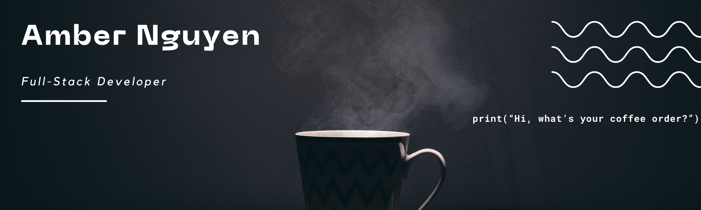

## Hi there 👋

Thank you for taking the time to check out my Github account.

My name is Amber and I'm currently working towards my goal of becoming a software developer.

I recently graduated from the She Codes Plus Program in Perth, Australia.

I am looking for work opportunities.

<a href="https://github.com/ambo-n/portfolio/blob/main/assets/about/amber_resume.pdf" target="_blank"> Download my resume </a>

---

  
  

---

    
  
My projects

  

| Project                                 | Repositories                                                                                                                                                                   | Live Website                          | Tech                                                                                                                                                                                                                                                                                                                                                                                                                                                                                                                                                                                                                                                                                                                                   |
| :-------------------------------------- | :----------------------------------------------------------------------------------------------------------------------------------------------------------------------------- | :------------------------------------ | :------------------------------------------------------------------------------------------------------------------------------------------------------------------------------------------------------------------------------------------------------------------------------------------------------------------------------------------------------------------------------------------------------------------------------------------------------------------------------------------------------------------------------------------------------------------------------------------------------------------------------------------------------------------------------------------------------------------------------------- |
| Portfolio                               | <a href="https://github.com/ambo-n/portfolio" target="_blank">Repo</a>                                                                                                         | https://ambondev.com/                 |                                                                                                                                                                                                                                                                                                                                                                                                                        |
| Weather Data Converter                  | <a href="https://github.com/ambo-n/weather-project" target="_blank">Repo</a>                                                                                                   |                                       |                                                                                                                                                                                                                                                                                                                                                                                                                                                                                                                                                                                                                                           |
| Crowdfunding Platform                   | <a href="https://github.com/ambo-n/crowdfunding_back_end" target="_blank">API</a>  <a href="https://github.com/ambo-n/sprout" target="_blank">Front-end</a>                | https://ambon-sprout.netlify.app/     |        |
| Furfuture Funding Scholarship Directory | <a href="https://github.com/SheCodesAus/ramcats_backend" target="_blank">API</a>   <a href="https://github.com/SheCodesAus/ramcats_frontend" target="_blank">Front-end</a> | https://furfuturefunding.netlify.app/ |        |

   

    

  
 Tech Stack

    
##### Languages
   

##### Frameworks & Libraries

   

##### Data

##### Platforms & Relevant Tools

  

##### Cloud Services & Hosting

 

---

## <b> Lets Connect</b>

 
